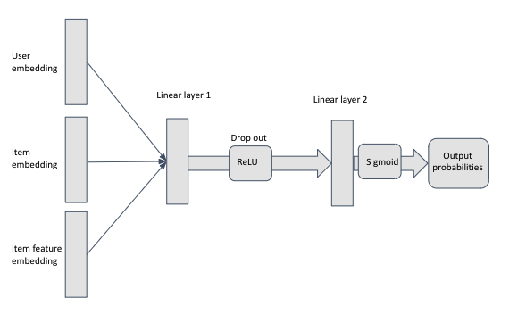

# Collaborative_filtering based on implicit ratings
Collaborative filtering using pytorch.

## Implicit Rating Recommender

In this problem statement, we wish to predict if the user is going to like a certain item based on his behavior. \
It is different from the Explicit case as:\
	1. The training data, we don't have any negative feedback i.e all the samples are positive examples.
	2. No level of preference. Ex 1("totally dislike") vs 10("really like")
	3. More available and easier to get

### Data Description

Four columns:
* User ID: id of users
* Item ID: id of items
* Context feature id: id of the user-based feature. ex: id could represent the nationality, location, device type of the user.
* Item feature id: id of the item-based feature. ex: id could represent the genre of a particular item

Training data had 970245 samples.

### Negative Sampling

As we only had positive Samples, we generate samples based on user-oriented and popularity-based negative sampling approaches.
The idea behind these sampling approaches is quite intuitive:
**User-Oriented Negative Sampling**: The user has viewed more items, those items that she/he has not viewed will be sampled with high probability.
**Popularity Base Negative Sampling**: Sampling probability of the item would be in inverse relation to popularity.

### Matrix Factorization

Matrix factorization is the way to identify the relation between items' and users' entities. The utility matrix can be written as:

`Y = U*V`

where Y is the utility matrix. U and V are the trained user and item embedding respectively. Here is a small representation of how its looks. 

As this is a binary classification problem, we use binary cross-entropy to compute the loss.

### Dropout Method for Cold-Start User

One of the major issues while building any recommendation system is dealing with cold users. The test data had almost 80% cold users. To deal with this problem, we trained one embedding vector specifically for cold-start users. We used the technique of dropout which randomly picks samples while training and maps them to average cold-start user embedding. 

### Model Architecture

The final model architecture involved a feedforward neural network with two-layer after learning the user and item-based embedding from Matrix Factorization. We also trained context feature id and item feature id which further improved our performance. Below is the architecture of the final model.

The final layer is the sigmoid layer computing the class probability.

### Evaluation Metric 

The evaluation metric used for this task was log loss. These are the validation log loss at each step:
1. Matrix Factorization: 0.52
2. Matric Factorization with single layer NN: 0.47
3. Matrix Factorization with two-layer NN: 0.44

Other methods used including hyperparameter tuning are explained in the presentation
Paper referenced: https://proceedings.neurips.cc/paper/2017/file/dbd22ba3bd0df8f385bdac3e9f8be207-Paper.pdf

### Contributors
1. Rogen Ren
2. Shubham Thakur

